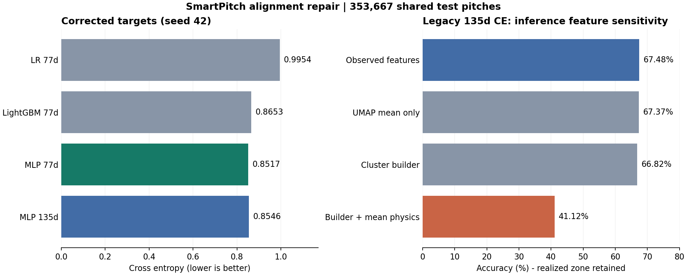

# 77d 정답 정렬 수정과 실제 재학습 — 2026-09-21

Windows RTX 4070 Laptop GPU에서 실제 데이터로 재학습했다.
핵심 결론은 **77d 기준선의 collapse가 입력 표현력의 한계라는 기존 해석을 철회해야 한다**는 것이다.
수정된 77d MLP는 같은 투구로 학습한 135d MLP와 비슷한 정확도이고, 이번 seed에서는 CE가 더 작다.
관측된 투구를 분류하는 성과와 투구 전에 행동을 추천하는 성과는 구분해야 한다.



## 1. 오류와 수정

기존 `04_preprocess.py`는 정렬하지 않은 행으로 Model B 입력을 저장한 뒤, 타자별로 정렬한
행으로 Model C의 `labels_10_*.npy`를 저장했다. 13·14·15 학습 스크립트가 전자의 입력과
후자의 정답을 결합했다. 길이는 같아서 기존 테스트로 검출되지 않았다.

| Split | 정제된 투구 수 | 다른 정답이 연결된 행 | 비율 |
|---|---:|---:|---:|
| Train | 1,494,188 | 1,047,310 | 70.09% |
| Validation | 385,320 | 270,681 | 70.25% |
| Test | 353,776 | 247,918 | 70.08% |

새 계약은 입력, 4/10-class 정답, `(game_pk, at_bat_number, pitch_number)`, 클래스 순서를
하나의 파일에 저장한다. 이전 형식은 명시적으로 거부하며 sequence 정답으로 대체하지 않는다.
중복·누락 ID, 클래스 순서 불일치, split 간 동일 투구 중복도 검증한다.

추가로 `build_135dim_feature(..., pitcher_id=...)`가 JSON의 정수 클러스터 ID를 문자열 키로
변환하지 않아 `KeyError`를 내는 버그를 수정했다. 알 수 없는 라벨이 pandas에서 NaN으로
변환되더라도 -1 sentinel로 일관되게 처리하도록 보완했다.

## 2. 비교 조건

- Train: 2022–2023, validation: 2024년 1–6월, test: 2024년 7월 이후.
- 135d와 공통으로 존재하는 train **1,493,038**, val **384,849**, test **353,667** 투구.
- 원본 parquet에서 77d 입력을 재생성해 기존 값과 완전히 같음을 확인했다.
  외부 handoff를 키로 결합한 135d 입력과 정답도 기존 파일과 완전히 같음을 확인했다.
- 77d와 135d MLP는 같은 행, 정답, seed 42, hidden 128×2, dropout 0.2, batch 256,
  AdamW(lr=0.001, weight decay=1e-5), cosine scheduler, 최대 30 epochs, patience 5를 사용했다.
  검증 손실로 checkpoint를 선택했다. gradient norm은 1로 제한했다.
- LR은 기존 방식대로 seed 42로 선택한 500,000행을 사용했다. LGB와 MLP는 전체 train을 사용했다.
  따라서 LR 대 다른 모델은 학습량까지 동일한 비교는 아니다.
- LR/LGB의 기본값은 class weighting 없는 CE이며, 이전 가중치 설정은 별도 통제 실험으로 둔다.
- 한 번의 seed 비교다. seed 반복에 따른 변동성까지 검증한 결과는 아니다.
- MLP 77d는 27,786개 파라미터, best epoch 24(29 epochs 실행), 135d는 35,210개,
  best epoch 11(16 epochs 실행)이다. 동일한 patience 규칙으로 학습 길이가 달라졌다.

## 3. 수정된 기준선: 공통 test에서의 실측

CE, Brier, ECE는 낮을수록 좋다. Brier는 클래스별 제곱오차의 합을 표본 평균한 값이다.
ECE는 최고 확률과 argmax 정답률의 15개 동일 폭 구간 오차다.

| 모델 | Top-1 | CE | Brier | ECE | Macro-F1 |
|---|---:|---:|---:|---:|---:|
| Train 경험적 클래스 prior | 41.11% | 1.4607 | 0.7008 | — | — |
| LR 77d CE | 64.36% | 0.9954 | 0.5040 | 0.0046 | 0.2324 |
| LightGBM 77d CE | 67.29% | 0.8653 | 0.4432 | 0.0077 | 0.3054 |
| **MLP 77d CE** | **67.67%** | **0.8517** | **0.4379** | 0.0136 | 0.2958 |
| MLP 135d CE, 새 학습 | 67.60% | 0.8546 | 0.4391 | 0.0112 | 0.2986 |
| LR 77d sqrt-balanced | 62.37% | 1.1141 | 0.5461 | 0.1040 | 0.2782 |
| MLP 77d Focal (gamma 2) | 67.52% | 0.9250 | 0.4805 | 0.1465 | 0.2981 |
| LightGBM 77d balanced | 53.31% | 1.2163 | 0.5877 | 0.0373 | 0.3279 |

과거 MLP와 같은 Focal 목적함수를 유지해도 수정된 77d는 67.52%를 기록했다.
따라서 CE로 바꾼 것만으로 collapse가 사라졌다고 설명할 수 없다.
Focal 실행은 best epoch 13, 18 epochs에서 조기 종료됐다. 과거 실행의 seed가 고정되지 않았고
복구 실험은 공통 cohort와 gradient clipping을 사용하므로 완전한 bitwise 재현은 아니다.
LR sqrt-balanced는 기존과 같은 500-iteration 한도에서 수렴 경고가 있었다.
가중치 없는 LR은 409 iterations에 수렴했다. 가중치 통제 실행을 최적화가 끝난 최선의 LR로
해석하지 않는다. LGB balanced는 1,000-round 한도에 도달했다. Macro-F1은 높지만 CE/Brier가
악화됐으므로 원래 클래스 발생률의 확률 추정에 그대로 유리하다고 해석할 수 없다.

1,207개 test 경기를 단위로 2,000회 paired bootstrap했다.
135d minus 77d MLP의 CE 차이는 **+0.002889**, 95% 구간 **[+0.002432, +0.003333]**이다.
정확도 차이는 **-0.0763%p**, 구간 **[-0.1395, -0.0130]%p**이다.
이는 고정된 두 모델에 대한 경기 표본 불확실성으로, 학습 seed 불확실성을 포함하지 않는다.

따라서 이번 결과로 135d의 보편적 열등함을 주장할 수는 없다. 반면
“77d는 41%에 갇히고 Arsenal 추가가 +26.5%p를 만들었다”는 과거 주장은 유지할 수 없다.
58d에는 UMAP, count cluster, arsenal이 함께 들어 있어 개별 성분의 효과도 아직 분리하지 않았다.

## 4. 확률 보정

test를 사용하지 않고 validation 예측에 scalar temperature를 맞췄다.
다만 같은 validation을 early stopping에도 사용했으므로 독립된 calibration holdout은 아니다.

| 모델 | Temperature | 보정 후 CE | 보정 후 Brier | 보정 후 ECE |
|---|---:|---:|---:|---:|
| MLP 77d CE | 0.951695 | 0.8511 | 0.4376 | 0.0023 |
| MLP 135d CE | 0.959860 | 0.8542 | 0.4389 | 0.0022 |
| MLP 77d Focal | 0.664567 | 0.8847 | 0.4507 | 0.0565 |

클래스별 recall, 예측 확률 평균, 실제 발생률, Brier, ECE도 JSON 보고서에 저장한다.
Single~HR의 argmax recall 0은 해당 확률이 0이라는 뜻이 아니다.
예를 들어 기존 135d CE checkpoint의 test 평균 HomeRun 확률은 약 0.7716%였다.
희소 클래스의 ECE는 낮은 확률 구간에 집중될 수 있어 단독 선정 지표로 쓰지 않는다.
보정값은 분석용으로 저장했으며 기존 추론 wrapper의 동작은 자동 변경하지 않았다.

## 5. 실제 추론 입력으로 바꾸면 생기는 차이

기존 CE/Focal checkpoint를 동일한 353,667개 test 투구에서 다시 추론했다.
클러스터 변환은 현재 프로젝트의 실제 `build_135dim_feature` 함수와 대조했다.

| 기존 모델 / 입력 | Top-1 | CE |
|---|---:|---:|
| 135d CE / 원래 관측 특징 | 67.48% | 0.8570 |
| 135d CE / UMAP만 0 | 67.37% | 0.8599 |
| 135d CE / 실제 클러스터 평균 builder | 66.82% | 0.8870 |
| 135d CE / builder + 물리량 15개를 정규화 평균으로 대체 | 41.12% | 2.1479 |
| 135d Focal / 원래 관측 특징 | 67.64% | 0.9263 |
| 135d Focal / 실제 클러스터 평균 builder | 67.30% | 0.9339 |
| 135d Focal / builder + 물리량 평균 대체 | 41.01% | 1.9849 |

평균 대체는 rl-agent가 `pitch_feature_means`를 받지 않을 때의 기본 경로에 해당한다.
구종별 평균을 제공하는 모든 배포 설정의 성능이라고 일반화하면 안 된다.
모든 변형에서도 **실제 관측된 zone과 pitch type은 유지**했다.
따라서 이 수치는 입력 변화 민감도이고, 투구 전 추천이나 제구 오차까지 검증한 성과가 아니다.

현재 builder는 `[82]`의 count-cluster 값도 투수 클러스터 평균으로 대체한다.
이번 test에서는 이 값이 원본과 100% 달랐다. count에서 결정되는 특징을 투수 평균으로
바꾸는 설계는 수정 대상이지만, 상류 count mapping의 학습 범위부터 확정해야 한다.

## 6. 상류 데이터의 시간 범위

77d `scaler.pkl`은 2022–2023 정제 train 1,494,188행으로 다시 fit한 평균·분산과 정확히 같다.
반면 상류 UMAP/Arsenal에 대해서는 train-only임을 입증할 수 없다.

- 현재 `clustering`의 subsample index 500,001개 중 **165,520개가 2024년**이다.
- `arsenal_group.py`는 전달받은 embedding 전체에서 투수별 통계를 만들며 날짜 필터가 없다.
- 현재 cluster input은 2,231,554행이나 저장된 embedding metadata는 2,981,450행이다.
  metadata의 subsample 크기 500,000도 현재 index 길이와 다르다.

이는 현재 파이프라인의 시간 누수 위험과 산출물 출처 불일치의 증거다.
현재 index가 과거 checkpoint 생성 시 사용한 정확한 index였다고 단정하지 않는다.
상류 산출물을 train-only로 다시 생성하고 transform/lookup만 validation·test에 적용하기 전에는
135d/151d를 엄격한 시간 분리 실험으로 홍보하면 안 된다.

## 7. 재현 명령과 산출물

기존 데이터·checkpoint·evaluation은 덮어쓰지 않았다. 새 데이터와 대형 실행 산출물은 Git 제외다.
명령은 저장소 루트에서 실행하며, 각 output/run 경로는 아직 존재하지 않는 경로여야 한다.

```powershell
uv run python scripts/48_prepare_aligned_points.py --handoff C:\Users\zpfh1\Projects\data\data\outputs\handoff_v1.parquet --output-dir data/aligned_new
uv run python scripts/13_train_logistic_regression.py --data-dir data/aligned_new --run-dir outputs/alignment_repair_new/lr77 --max-train 500000
uv run python scripts/14_train_lightgbm.py --data-dir data/aligned_new --run-dir outputs/alignment_repair_new/lgb77
uv run python scripts/15_train_mlp_10class.py --data-dir data/aligned_new --run-dir outputs/alignment_repair_new/mlp77 --device cuda
uv run python scripts/15_train_mlp_10class.py --data-dir data/aligned_new --run-dir outputs/alignment_repair_new/mlp135 --input-dim 135 --device cuda
uv run python scripts/49_compare_aligned_runs.py --data-dir data/aligned_new --runs outputs/alignment_repair_new/mlp77 outputs/alignment_repair_new/mlp135 --output outputs/alignment_repair_new/comparison.json
```

`48`은 과거 데이터와 정확히 대조하는 복구 도구다. 완전히 새로운 데이터 전처리는
`04_preprocess.py --years 2022 2023 2024 --raw-dir ... --output-dir ...`를 사용한다.
04는 기존 위치를 덮어쓰지 않는 새 기본 출력 `data/aligned_preprocessed`를 사용한다.
`13`–`15`는 필수 `--data-dir`, `--run-dir` 인자를 받는다.
이전 손실 설정은 `--class-weight sqrt-balanced`(LR), `--class-weight balanced`(LGB),
`--loss focal`(MLP)로 별도 실행한다.
과거 `17` 비교기는 `--allow-legacy --output 새경로`로만 열리며 공정 비교용으로 사용하지 않는다.

이번 실행 위치: `data/aligned_20260921/`, `outputs/alignment_repair_20260921/`.
각 run에는 설정·투구 ID hash·학습 이력·최선 checkpoint·검증/test 예측·확률 지표가 저장된다.
LR은 pickle, LGB는 text 모델이다. MLP checkpoint는 `best.pt`이다.
새 모델들은 기존 기본 checkpoint를 자동으로 대체하지 않는다.

검토와 Git 이관용 작은 결과 파일은 다음에 보존했다.

- [7개 실행의 전체 비교·보정·bootstrap·클래스별 지표](results/alignment_20260921/comparison.json)
- [원본 정렬 대조](results/alignment_20260921/data_alignment_audit.json)
- [추론 입력 민감도](results/alignment_20260921/inference_feature_audit.json)
- [Scaler와 상류 데이터 출처 점검](results/alignment_20260921/provenance_audit.json)
- [CPU 추론 시간 측정](results/alignment_20260921/latency_idle.json)

7개 run의 validation/test 예측 ID와 정답을 canonical 데이터에 모두 다시 대조했다.
예측 파일 SHA-256와 최종 소스 snapshot hash도 비교 JSON에 저장했다.
최종 소스 hash는 보고 시점의 작업 트리이며 모든 소스 편집이 학습 시작 전에 끝났다는 뜻은 아니다.
두 CE 실행 사이 CUDA 학습 동작은 동일했다. 이후 변경은 metadata·MPS 호환·포맷과 검증 보완이다.

별도 학습이 끝난 뒤 CPU 1 thread에서 번갈아 측정한 단일 forward+softmax 중앙값은
77d **0.0622 ms**, 135d **0.0628 ms**였다(각 2,000회, warmup 200회).
batch 1,024개 중앙값은 각각 1.418 ms, 1.644 ms였다.
이는 이 노트북의 모델 계산 시간이며 특징 생성·파일 읽기·서비스 지연을 포함하지 않는다.

## 8. 졸업작품의 다음 완료 기준

모델을 더 크게 만들기 전에 아래를 완료해야 한다.

1. 상류 특징을 시간 분리해 다시 만들고, seed 반복으로 77d/135d 차이를 확인한다.
2. 투구 전 관측 상태, 선택 행동, 실제 도착 위치·물리량의 확률 분포를 분리한다.
   학습과 평가에 같은 입력 생성기를 사용하고 실제 zone을 목표 zone으로 간주하지 않는다.
3. 독립 calibration split과 희소 사건 확률 검증을 추가한다.
4. 경험적 전이확률 기준선과 정책을 독립 환경/검증된 오프라인 평가 조건에서 비교한다.
   같은 모델이 만든 환경의 보상 증가만으로 실제 기대 실점 개선을 주장하지 않는다.

이 보고서는 최초 기준선 복구 단계의 기록이다. 같은 날 후속 작업에서 반복 seed 실험,
별도 운영 프로필 생성, 독립 calibration 및 실제 기록을 이용한 정책 평가를 실행했다.
[후속 최종 보고서](OPERATIONAL_VALIDATION_2026-09-21.md)를 현재 상태로 사용한다.
상류 UMAP 자체는 재생성하지 않았으며, 정책 평가는 끝났지만 실점 개선은 입증하지 못했다.

## 9. 검증

- 최종 전체 pytest: **147 passed, 2 skipped**, 91.37초.
- 실제 `04_preprocess.py` 진입점에서 point/sequence 정렬이 달라지는 fixture를 전처리하고,
  저장된 파일을 새 loader로 읽는 회귀 테스트를 포함한다.
- 구형 파일 거부, ID 중복/누락, split 중복, 클래스 순서, invalid label, 확률 정규화,
  다른 순서의 예측 정렬, ID별 정답 불일치, 정수 클러스터 ID를 검증한다.
- 새 데이터·학습·평가 경로의 Ruff 검사 통과. 기존 모듈의 과거 스타일 위반 전체를
  이번 작업에서 일괄 수정하지 않았다.
- 과거 결과를 담은 노트북 7개에 정정 셀을 추가하고 JSON 구조를 확인했다.
- 기존 사용자 그림·발표 생성 스크립트와 `_INVALID_GEMINI_DUMMY` 파일은 수정하지 않았다.
- 작업 브랜치는 `codex/fix-point-label-alignment`이다. 현재 변경 이력과 이관 방법은 Git 및 유지보수 안내를 참조한다.
