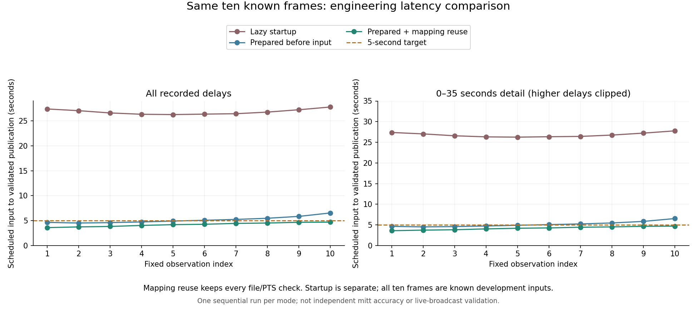

# 같은 시각 대응표의 반복 계산 줄이기 — CV-20

CV18은 입력 전 모델 준비 후에도 10개 중5개만5초 내에 발행됐다. 원본 프레임 추출,
요청 작성, 응답 수락에서 같은 시간 대응표를 반복 계산하는 비용을 이번 단위로 분리했다.
실제 영상 모델을 다시 실행하기 전에 [비교 조건](results/cv_local_20261007/clock_cache_preregister_v1.json)을 고정한다.

## 변경 범위

`clip_clock.audit_mapping` 원함수는 그대로다. 새 `cached_audit_mapping`은 매 호출에서
다시 읽은 source/clip framemd5의 정확한 바이트 쌍이 같을 때만 앞선 성공 결과를 재사용한다.
영상이나 모델 출력, 파일 검증 성공 여부를 캐시하지 않는다. `_capture_inputs`의 호출 한 줄만
바뀌었으며 원본·영상·영수증·표의 SHA 검사, 프레임 PTS·MD5·크기·길이 대조,
미래 프레임 및 누락 구간 거절은 기존대로 수행한다.

입력합4MiB 이하·직렬화 결과16MiB 이하인 가장 최근 성공 한 쌍만 보관한다.
키와 결과는 하나의 불변 항목으로 잠금 아래 교체한다. 호출자에게는 매번 중첩 구조까지
새 객체를 반환한다. 결과를 수정해도 다른 호출의 기준이 바뀌지 않는다.
한도 초과·잠금 경합은 해당 입력의 원함수를 실행한다. 감사 오류는 그대로 전달하며
이전 성공 결과로 대체하지 않는다. `clear_mapping_cache`는 시험 격리용이며 실행 중 다른
계산이 나중에 끝나 다시 저장하는 것까지 취소하는 API는 아니다.

파일명·크기·mtime이 같다는 이유만으로 재사용하지 않는다. 입력 내용이 달라지면 다른
계산이며, 영수증과 내용이 어긋나는 자료는 캐시에 접근하기 전 기존 무결성 검사에서 거절된다.
이것은 신뢰하는 로컬 실행의 일관성 보호이며 별도의 보안 sandbox가 아니다.

## 고정 비교

새 Python 프로세스와 빈 캐시에서 시작한다. 기존 preflight가 시간표를 읽을 수 있으나
모델에 연구 이미지를 전달하는 것은 READY 이후다. Faster 전체 화면/CUDA/4threads/0.5,
검정1280×720 warmup5회, 원래10개 cutoff와5초 간격을 그대로 사용한다.
원본 이미지는 시각이 도착한 뒤 기존FFmpeg 명령으로 추출하며 앞당겨 읽지 않는다.
1회 실행의 모든 입력·기권·오류·미시도를 보존하고 재시도하지 않는다.

시작 준비·전체 명령 시간과 예정 입력→검증 후 발행 지연을 함께 보고한다.
기존 CV18과는 순차 단일 실행의 개발 비교이며 일반적인 속도 효과나 신뢰구간을 주장하지 않는다.
픽셀·검출 상자·점수·선택 상태도 대조하지만 같다는 사실은 정확도의 증거가 아니다.
CV13/15의 서비스 채택 보류, CV6 실제 사람 응답 대기, 전체 타석·미열람 검증 미완료는 유지한다.

별도 미세 측정은 원본 시간표 바이트만 사용한다. 원함수 첫 호출과 캐시 첫 계산을 따로
기록한 뒤 정해진 교대 순서로5쌍을 측정한다. 매번 결과 동등성을 검사한다.
이 시간은 파일 읽기·SHA 검증·추출·모델·전체 루프를 포함하지 않으므로 전체 성능으로 쓰지 않는다.
앞선 cProfile의 mapping0.309초·parse0.187초·SHA0.049초는 계측한 한 호출의 원인 조사이며
비계측 성능 기준선이 아니다.

## 검증 및 재현

새 합성25개, 기존 clock/frame/session/loop154개 통과. 원함수 AST가 이전과 같음을 확인했다.
반환값 오염, 동일 길이 입력 변경, 입력/결과 크기 초과, 잠금 경합, 원예외 전파,
자료·영수증·경로 변조와 미래 프레임 거절을 확인했다. 위 수치는 실제 GPU 모델 호출 전 검증 기록이다.

실제 측정은 고정된 새 계획으로 기존 명령을 사용한다. 이전 실행 폴더와 영수증을 덮어쓰지 않는다.

```bash
python -m intent.local_glove_ready --plan PLAN.json --out outputs/cv_local_clock_cache_run_NEW --startup-timeout 60
python -m intent.local_glove_observer_report --run outputs/cv_local_clock_cache_run_NEW --out REPORT.json
```

개인 경로가 있는 계획·startup 상세·영상·모델은 Git에서 제외하고 요약과 코드만 보존한다.
이전 CV18 재현에는 해당 커밋의 코드를 사용하며 과거 코드 SHA를 새 값으로 바꾸지 않는다.

실측 전 전체Windows CPU검사:1588 passed·5 skipped·2 deselected(386.70초), Ruff140경로통과.

## 실제 결과

사전 등록 `3fdef88`을 푸시한 뒤 새 프로세스에서 한 번 실행했다. 계획10개를 모두 수락했고
오류·미시도0, 단일 후보4·복수2·후보없음4, 확정 미트0이다. 모든10개의 예정 입력→발행이
5초 이내였다. 이 비율은 처리 완료율이며 미트 정확도나 실제 경기의 투구 전 가용률이 아니다.

| 지표 | CV18 | CV20 |
|---|---:|---:|
| 예정 입력→검증 후 발행 중앙값 | 4.9845초 | 4.227초 |
| 가장 늦은 발행 | 6.531초 | 4.703초 |
| 5초 이내 / 계획10개 | 5/10 | 10/10 |
| 단일 글러브 후보 및5초 이내 / 계획10개 | 2/10 | 4/10 |
| 준비 단계 | 20.015초 | 19.266초 |
| 입력 일정부터 루프 종료 | 51.547초 | 49.703초 |
| 명령 시작부터 종료까지 | 76.115초 | 73.227초 |

10입력의 첫 시각과 마지막 시각 사이45초를 포함한다. 순수 모델 연산 시간과 혼동하지 않는다.
준비 전 연구이미지0, 검정warmup5회/engine1개, worker 종료확인·exit0이다.
입력 이미지·설정·검출 상자·점·점수·선택상태·표준응답이 CV18과10개 모두 동일했다.
독립 코드 검토에서 캐시 적중 때에도 원본검증과 미래차단이 유지됨을 확인했다.

시간표 함수만의5쌍 비교는 중앙99.60ms→8.56ms다.
첫 cache miss는174.84ms로 원함수 첫호출103.09ms보다 길었다.
12번의 함수 결과는 모두 동등했다. 함수 측정에는 파일 읽기/SHA/추출/모델이 포함되지 않는다.
두 영상 실행은 무작위 교대 반복이 아니며, 전체 시간 차이를 캐시만의 인과효과로 확정하지 않는다.
최대4.703초는 기준과0.297초 차이밖에 없어 다른 부하와 반복 실행에서도 만족한다고 보장하지 않는다.



근거: [실행 보고서](results/cv_local_20261007/clock_cache_report_v1.json),
[준비·종료 감사](results/cv_local_20261007/clock_cache_run_audit_v1.json),
[출력 대조](results/cv_local_20261007/clock_cache_comparison_v1.json),
[함수 비교](results/cv_local_20261007/clock_cache_mapping_microbench_v1.json).
해당 코드의 [Linux/mac CI](https://github.com/Pitcheezy/transition-models/actions/runs/37564255807)도 모두 성공했다.

다음은 새기기계획 생성(CV21)과 고정 조건의 반복 측정이다. 품질 개선에는 준비된26장 실제
사람 재검토와 새영상 검증이 여전히 필요하다. 이번10장은 계속 알려진 개발 자료다.
