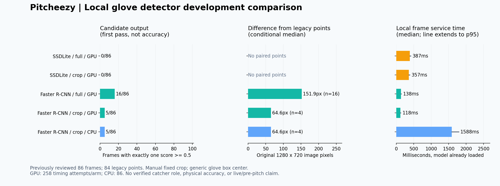

# 로컬 글러브 탐지 비교 결과 — 2026-10-07

**두 범용 COCO 탐지기 모두 현재 미트 판독기로 채택하지 않는다.** GPU에서 반복 처리는 빠르지만,
고정 임계값에서 후보가 적고, 나온 좌표도 기존 사람 점과 차이가 컸다.
작은 모델의 설정·전처리를 설치된 공식 구현과 읽기 전용으로 대조했으며 구조 불일치는 발견하지 못했다.
결과를 보고 임계값이나 crop을 바꾸거나 실패를 교체하지 않았다.

사전 등록·코드: `8ac36f7`. 실행 전에 원격 브랜치에 푸시했다.
[규약과 준비](CV_LOCAL_DETECTOR_V1.md) · [전체 수치](results/cv_local_20261007/comparison_v1.json).

## 관측 결과

| 조건 | 후보 출력 | 후보 없음/복수 | 기존 점과 거리 중앙값 | 처리 중앙값/p95 (ms) |
|---|---:|---:|---:|---:|
| SSDLite 전체 GPU | 0/86 | 86/0 | — | 386.7 / 417.9 |
| SSDLite crop GPU | 0/86 | 86/0 | — | 357.2 / 389.8 |
| Faster R-CNN 전체 GPU | 16/86 | 69/1 | 151.93px (n=16) | 137.5 / 147.7 |
| Faster R-CNN crop GPU | 5/86 | 80/1 | 64.61px (n=4) | 118.2 / 130.5 |
| Faster R-CNN crop CPU | 5/86 | 80/1 | 64.60px (n=4) | 1587.7 / 1788.7 |

후보 수는 정확도가 아니다. 거리는 AI 후보와 기존 사람 점이 모두 있는 경우만 계산했다.
GPU 각 조건 258회(86장 × 3회), CPU 86회로 총 1,118개 정지화면 처리를 완료했다.
오류·미시도 0, 고정 입력·코드·가중치 검증 모두 통과했다. 각 조건의 첫 86회만 위치 비교에 썼다.
반복 3회는 새 독립 표본이 아니다. 모델별 준비용 검은 이미지 5회는 처리 분모에서 제외했다.

SSDLite는 전체/crop 모두 0/86이다. Faster R-CNN 전체 화면은 두 경기에서 각각 5/29, 11/57을
출력했지만 거리 중앙값은 각각 298.09px, 147.38px였다. crop은 823407에서 0/29,
849845에서 5/57이다. 5개 중 1개에는 과거 사람 점이 없어 거리 분모는 4다.
그 1개를 false positive로 판정하지 않는다. 옛 기권은 현행 미트 부재 음성 라벨이 아니다.
Faster R-CNN crop의 20px 이내 사례는 전체 사람 표시 84장 중 1장이며, 이 수치는 개발용
민감도 요약일 뿐 확정된 성공 기준이나 새 정확도가 아니다.



## 시간의 의미

표는 **모델 적재 후** 원본 읽기·해시·decode·추론·후처리·개별 결과 기록까지의 시간이다.
최종 집계 기록과 결과 파일의 해시 연결은 제외한다. 최초 모델 준비는 별도로 약 15.4–18.1초였다.
따라서 118ms를 처음 실행부터 사용자에게 결과가 보이는 시간이라고 설명하면 안 된다.
Windows RTX 4070 Laptop GPU, torch 2.6.0+cu124, torchvision 0.21.0+cu124, CPU 4 threads에서
정해진 순서로 실행했다. 모델 순서를 무작위화한 하드웨어 성능 시험이 아니다.
영상 수신·투구 동기화·실시간 도착·포수 역할·물리 좌표 정확도는 측정하지 않았다.

## 다음 결정

CV-14는 영상 루프에 후보/기권/오류/시간을 연결하는 기술 점검으로만 진행한다.
일반 글러브 상자를 포수 미트로 승격하지 않고, 기존 화면 응답에는 확정 좌표를 발행하지 않는다.
이 연결의 성공을 미트 판독 모델 성공으로 해석하지 않는다.

CV-15는 기존 84개 사람 점으로 작은 조건부 위치 회귀 후보를 개발한다. 한 경기로 학습해 다른
경기에 적용하는 두 방향을 고정하고, crop 중심·학습점 평균 기준선과 비교한다. 두 경기 모두
이미 본 개발 자료다. 추가 사람 검토, 미열람 영상 검증, 전체 타석 검증은 계속 별도 과제다.
기존 M3 수치·JSONL·사이트·팀원 코드/API는 변경하지 않았다.

## 재현

다섯 조건의 상세 설정·원본 해시·가중치 URL/SHA는 사전 등록에 있다. 실행은 준비 문서의
`intent.local_glove_benchmark`와 `intent.local_glove_report` 명령을 새 출력 경로에 사용한다.
저장된 집계만으로 그림을 다시 만들 수 있다:

```bash
python scripts/plot_local_glove_comparison.py --input docs/results/cv_local_20261007/comparison_v1.json --out NEW_COMPARISON.png
```

원본 프레임·체크포인트·실행별 원문은 로컬 `outputs/cv_local_*`에 보존하고 Git에는 넣지 않는다.
공개 보고서는 입력 해시와 검증 범위를 구분한다. 저장 JSON 검증기가 직접 원본 영상을 다시
확인한 것처럼 표현하지 않는다. 실행기는 실제 원본·코드·가중치 바이트를 실행 전후 재검증했다.
