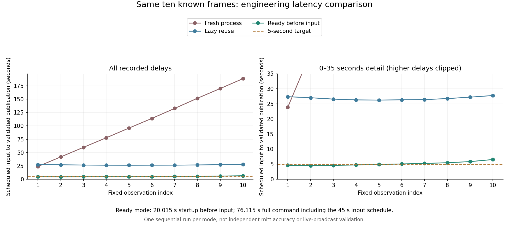

# 입력 전 준비를 구분한 영상 처리 — CV-18

CV-17에서 매번 로드하던 비용은 줄었으나 최초24.953초 지연이 남아 5초 발행은0/10이었다.
모델 준비를 입력 일정 시작 전에 완료하는 별도 개발 실행을 고정한다. 시작 비용을 숨기지 않고
preflight, startup, warm loop, 사용자가 처음 실행한 시점부터의 cold 전체 시간을 각각 기록한다.
wrapper의 cold_user_elapsed는 Python실행/import와 마지막 요약 저장을 제외한다.
별도 부모 perf_counter로 명령 시작→프로세스 종료 전체 시간을 재어 이 비용도 기록한다.

같은 Faster 전체/GPU/threshold0.5/4threads와 같은10시각을 사용한다. 단일worker를 한 번
준비하며 synthetic RGB검정1280×720 5회만 warmup한다. 이 수는 실제 결과 전에 고정했다.
study 프레임은 READY 이후에만 제공한다. READY timeout은60초다. 실패 시 원예외·종료 영수증,
계획10개/미시도10개를 남긴다. 자동 retry나 restart는 없다. 성공 후 기존 loop의 입력일정을 시작한다.

원본·설정·모델·응답 결속, shadow응답 항상mitt=null, 모호함/후보없음/오류 분리는 유지한다.
기존 CV-17 기본 lazy 동작은 그대로이며 optional prepare를 호출한 실행만 새모드다.
기존 CV-17 재현에는 해당 실행 커밋의 worker 코드를 쓴다. 과거 기록의 SHA를 새코드값으로 고치지 않는다.
이번 loop에는 CV-19의 맥/리눅스 가상환경 실행파일 결속 수정도 포함한다. 동일 일정/입력과
추출 방식은 유지하지만 코드가 완전히 동일한 단일요인 무작위 비교로 설명하지 않는다.

[사전 규약](results/cv_local_20261007/ready_preregister_v1.json).
아래 명령은 해당실행 계획에 ready/worker/observer/detector/report 코드파일이 결속되어야 한다.

```bash
python -m intent.local_glove_ready --plan PLAN.json --out outputs/cv_local_ready_run_NEW --startup-timeout 60
python -m intent.local_glove_observer_report --run outputs/cv_local_ready_run_NEW --out REPORT.json
```

startup 자료는 출력의 `.startup` 형제폴더에 보존한다. 두경로가 이미 있으면 시작하지 않는다.
성공한 warm-loop의 5초 비율도 콜드 시작·릴리스 전 성공·실시간 중계 검증과 다르다.
이 기술 비교로 기존 범용모델의 미트 판독 채택보류 결정을 바꾸지 않는다.

실제 모델 실행 전 전체Windows CPU검사:1563 passed·5 skipped·2 deselected,401.33초.
Ruff139경로통과. 기존Pillow deprecation경고2건, 새로운 실패0.

## 실제 실행 결과

사전 등록 커밋 `7d75ed0`을 원격에 푸시한 뒤 한 번만 실행했다. 10개 모두 수락,
오류·미시도 0이며 단일 후보4·복수 후보2·후보 없음4이다. 확정 미트는0이다.
준비 전에 연구 프레임을 제공한 수는0, 검정 합성 입력5회·모델 engine1개,
마지막 worker 종료 확인·exit code0을 기록했다. 실패를 대체하거나 실행을 다시 하지 않았다.

| 측정 범위 | 매번 새 프로세스(CV14) | 최초 요청에서 준비(CV17) | 입력 전에 준비(CV18) |
|---|---:|---:|---:|
| 예정 입력→검증 후 발행 중앙값 | 104.961초 | 26.664초 | 4.9845초 |
| 5초 이내 발행 / 전체10개 | 0/10 | 0/10 | 5/10 |
| 입력 일정 시작→루프 종료 | 233.562초 | 72.766초 | 51.547초 |
| 입력 일정 전 준비 | 별도 단계 없음 | 별도 단계 없음 | 20.015초 |
| 명령 시작→프로세스 종료 외부 측정 | 측정하지 않음 | 측정하지 않음 | 76.115초 |

입력은5초 간격이며 첫 입력과 마지막 입력 사이45초를 포함한다. 따라서 루프51.547초는
순수 모델 계산시간이 아니다. CV18의 짧은 루프만 CV14/17의 콜드 시작을 포함한 루프와
비교해 전체 실행이 그만큼 빨라졌다고 설명하지 않는다. 새 전체 명령 측정은76.115초다.
wrapper내 cold75.156초는 interpreter/import와 마지막 요약 저장을 제외하므로 별도 기록이다.
준비20.015초 중 모델 로드14.804초, 검정이미지 첫 모델 호출2.870초와 후속4회가 포함된다.

발행 지연은 4.516–6.531초이며 후반5개는5초를 넘었다.
단일 글러브 후보가 있으면서5초 이내인 경우는2/10이며, 이 역시 확인된 포수 미트는 아니다.
준비단계 추가로 콜드 시작에서 생기는 대기가 줄었지만 모든 입력의5초 기준은 미달이다.

모델 계산 중앙값은 0.217초다.
원본 프레임 추출 중앙값1.586초,
observer 전체1.211초, 요청 준비0.735초,
응답 검증·발행0.711초가 따로 들었다.
구간별 중앙값을 합쳐 전체 중앙값으로 해석하지 않는다. 다음 속도 개선 후보는
프레임 공급과 중복 파일 읽기 비용이지만, 출처·시각·SHA 검사를 제거해 수치를 낮추지 않는다.

세 방식의 원본 이미지10개와 설정10개가 같으며, 시간/요청ID를 제외한 검출 상자·점·점수·
선택 상태·표준응답도10개 모두 동일하다. 이는 저장 출력 일치이며 정확도나 사람 일치도가 아니다.
warmup 후 성능 좋은 결과만 선택한 것이 아니며, CV13의 범용 모델 채택 보류는 유지한다.
CV19 실행파일 보호 수정도 포함된 순차 단일 실행이므로 일반적 속도 향상이나 인과효과의
신뢰구간을 제시하지 않는다. 실시간 중계·실제 릴리스 전 가용률·전체 타석 검증은 미완료다.



근거: [보고서](results/cv_local_20261007/ready_report_v1.json),
[시작·종료 감사](results/cv_local_20261007/ready_run_audit_v1.json),
[세 실행 출력 대조](results/cv_local_20261007/replay_comparison_v1.json).
원본 프레임·모델·개인 경로가 든 startup 상세는 로컬 outputs에만 보존했다.

## 다음 품질 작업

CV15의6개 학습 조건이 단순 기준선을 넘지 못했다고 라벨 오류나 학습 접근 전체의 실패를
확정할 수는 없다. 기존 사람 검토86장(84점·2기권)은 완료 상태로 보존한다.
CV6의26장은 새 관측 규약으로 하는 추가 재검토이며 실제 응답은 아직0개다.
[준비된 검토 화면](CV_REVIEW_UI_V1.md)에서 기존 점·AI 출력을 보지 않고 미트 중심,
가시성·자세·판독 불가 이유를 실제 사람이 기록해야 한다. 편향 선정된 개발 표본이라는 한계는 유지한다.
추가 사람 검토·미열람 영상 검증 없이 작은 같은 자료에 맞춘 반복 튜닝으로 서비스 채택하지 않는다.
사람 응답 대기 중에는 CV5a4의 연속 타석 범위 확인과 출처를 보존하는 영상 공급 개선을 진행할 수 있다.

최종 생산 코드 `7d75ed0`의 [CI 37561979439](https://github.com/Pitcheezy/transition-models/actions/runs/37561979439)도 성공했다.
Ubuntu CPU1562 passed·6 skipped·2 deselected(44.78초), macOS CPU동일1562/6/2(120.39초).
Ruff139경로·JavaScript구문검사 통과, 기존180초 제한 유지. 이후 커밋은 결과·문서·그림만 추가한다.
