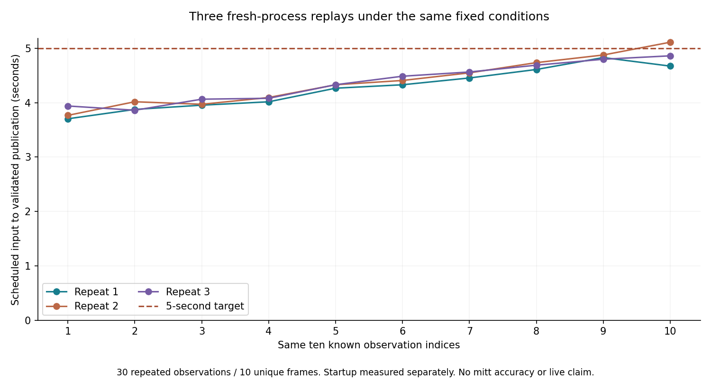

# CV22 — 고정 영상의 처리 지연 반복 확인

CV20 한 번의 최대 지연은4.703초로 5초 기준과0.297초 차이다. 성공한 한 번으로 지속적인
성능을 결론내리지 않고, 같은 조건의 새 프로세스3개를 순차 실행한다.
[호출 전 사전 등록](results/cv_local_20261007/repeatability_preregister_v1.json)을 커밋·푸시한 뒤 호출한다.

- 각10개 같은 cutoff, 전체30예정 관측. 고유 이미지는10장이다.
- 원 CV20 계획 바이트를 새 폴더에 복사한다. 코드·모델·설정·검사 대상·임계값은 그대로다.
- 각새프로세스: 빈대응표캐시 → 원출처검증 → 검정합성5회준비 → 같은45초입력일정.
- 각준비 timeout60초. 재시도·교체·임계값수정·성공표본선택·결과별조기종료 없음.
- 모든실패/미시도를 남기고 5초 비율의 분모는 매실행계획10이다.
- 로컬검사·다른모델실행과 시간을 겹치지 않는다. 일반OS부하는 통제하지 못한다.
- 입력해시·출력을 CV20과 대조한다. 전체명령은 부모 perf_counter로 재며 보고서 작성은 제외한다.

이것은 같은노트북·같은10장의 개발 반복성이다. 30독립표본·정확도·Mac속도·실시간중계
성공이나 전체타석 완성으로 확대하지 않는다. 확정미트는 계속0이다.

사전 등록 후 실행한 세 번의 결과를 아래에 보존했다.

## 실제 결과 — 2026-10-07

사전등록 `cf355ec`을 푸시한 후 세 프로세스를 순차 실행했다. 예정30개 중
수락30·오류0·미시도0이며,
5초 이내 발행은 **29/30**이다.
매실행10개 모두5초를 만족한 실행은 **2/3**이다.

| 반복 | 5초 이내 | 발행 중앙 | 발행 최대 | 준비 | 명령 전체 |
|---|---:|---:|---:|---:|---:|
| 1 | 10/10 | 4.296초 | 4.828초 | 18.531초 | 72.483초 |
| 2 | 9/10 | 4.367초 | 5.110초 | 17.797초 | 72.296초 |
| 3 | 10/10 | 4.407초 | 4.860초 | 18.313초 | 72.445초 |

모든 실행은 첫~마지막 입력 일정45초를 포함한다. 명령전체는 부모 perf_counter의
실행파일 시작→종료이며, 보고서 작성은 제외한다. 준비시간을 숨기거나 모델연산으로 대체하지 않는다.
입력·설정·검출·표준응답이 CV20과동일한 관측은30/30이다.
단일후보12·복수6·후보없음12·확정미트0.
반복은 오류를 포함해 그대로 보존했고 결과에 따른 모델·threshold·warmup 변경은 하지 않았다.

이 수치는 같은10장을 재사용한 관측30회다. 독립표본30개로 해석하거나 표본오차 신뢰구간을
붙이지 않는다. 앞선 CV20 한 번의10/10성공과이번반복은 모두 남긴다. GPU 노트북·고정개발영상의
처리 경로 개선은 확인했지만 일반부하·전체타석·실시간서비스의 지속적인5초보장은 미검증이다.
속도와 별도로 generic glove를 실제포수미트로 믿을 품질 근거는 부족해 서비스 채택보류를 유지한다.

[전체 집계·출력 대조](results/cv_local_20261007/repeatability_summary_v1.json),
[1회](results/cv_local_20261007/repeatability_run_01_report_v1.json),
[2회](results/cv_local_20261007/repeatability_run_02_report_v1.json),
[3회](results/cv_local_20261007/repeatability_run_03_report_v1.json).

CV21 관련검사99 passed(75.59초)·Ruff142경로 통과. 전체Windows1588검사는 CV20기준이며
CV21전체검사와혼동하지않는다. 최신 원격 CI 결과는 인계 기록을 따른다.
다음품질작업은준비된26장사람재검토이며, CV5a4전체타석확인/CV7미열람독립검증은여전히남았다.

## 코드 검증과 후속 점검

최신 코드 `cf355ec`의 [Linux/macOS CI](https://github.com/Pitcheezy/transition-models/actions/runs/37565118118)는
각각 **1632 passed, 6 skipped, 2 deselected**다. Ubuntu53.93초·macOS105.93초,
Ruff142경로와 JS 검사 성공. 이것은 CPU 소프트웨어 검사이며 Mac 모델 실행 결과가 아니다.
기존 M3 입력25개 SHA도 동일함을 다시 확인했다.

저장된 30개 처리 기록의 사후 탐색에서 프레임 추출은 중앙1.328초·최대1.968초였다.
5초를 넘긴 것은 2회차 마지막 입력 한 건이다. 이때 추출1.968초,
관측기 호출1.328초였고 나머지는 원본 검사·요청 준비·응답 검사에 사용됐다.
후반 프레임의 추출 비용이 늘어나는 경향은 다음 속도 점검 대상으로 남긴다.
이후 최적화가 필요하면 별도 규약을 고정하며, 이번 결과를 재실행해 교체하지 않는다.
[사후 구간 분석](results/cv_local_20261007/repeatability_trace_diagnostic_v1.json).
