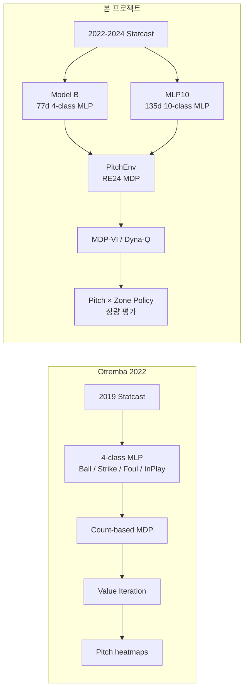
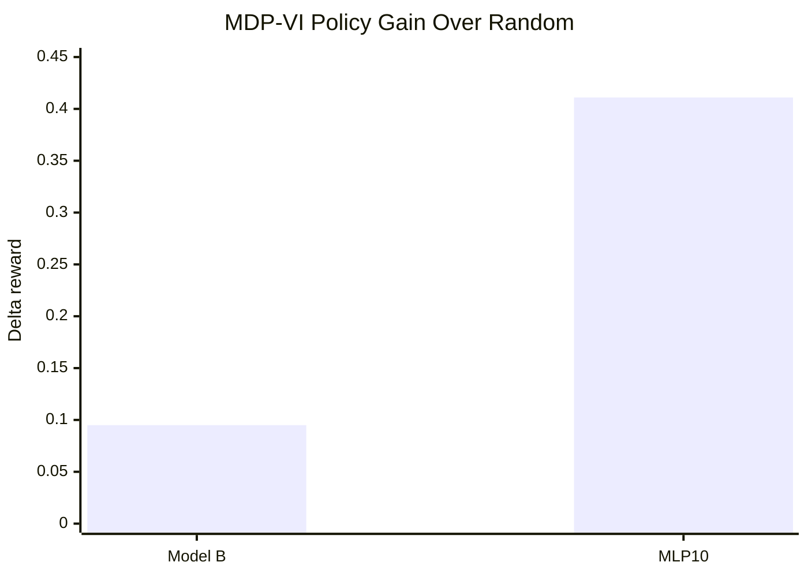

# Otremba 2022 기준 프로젝트 비교 A-to-Z

작성일: 2026-06-01  
기준 논문: **Otremba 2022, SmartPitch: Leveraging Statcast Data for Pitch Outcome Prediction with Machine Learning**

이 문서는 Otremba 2022를 기준점으로 두고, 본 프로젝트가 **무엇을 다르게 했는지**와 **성능이 어떻게 달라졌는지**만 정리한다. 전체 프로젝트의 모든 실험을 나열하지 않고, Otremba 2022와 직접 연결되는 유의미한 변경만 포함한다.

---

## 1. 한 줄 요약

Otremba 2022는 **4-class 전이확률 MLP + MDP Value Iteration**으로 투구 정책을 만드는 구조를 제시했다.  
본 프로젝트는 이 구조를 출발점으로 삼아, 현대 Statcast 데이터에서 4-class baseline을 재검증하고, 같은 MDP 계열에서 사용할 수 있는 **135-dim 10-class 전이모델(MLP10)**과 **RE24 기반 강화학습 환경**으로 확장했다.

---

## 2. 기준점: Otremba 2022가 한 일

| 구성 | Otremba 2022 |
|---|---|
| 목표 | 투수-타자 matchup을 MDP로 만들고, 타자의 공격 생산을 최소화하는 투구 정책 계산 |
| 상태 | 주로 볼카운트 기반 at-bat 상태 |
| 행동 | 투수가 선택하는 `(pitch type, location)` |
| 전이확률 모델 | 4-class MLP |
| 출력 클래스 | `Ball`, `Strike`, `Foul`, `InPlay` |
| 모델 입력 | pitch action, count state, batter profile 등을 결합한 77개 입력값 |
| 최적화 | Bellman Value Iteration |
| 보상 | Run Expectancy 기반 count 보상 + in-play xwOBA penalty |
| 평가 | 전이확률 모델 loss와 heatmap 해석 중심 |

Otremba 2022의 핵심은 **예측 모델 자체보다, 예측 확률을 MDP 전이확률로 사용해 장기 정책을 계산하는 구조**다.

---

## 3. 프로젝트가 달리한 핵심

| 축 | Otremba 2022 | 본 프로젝트 |
|---|---|---|
| 데이터 범위 | 2019 시즌 중심 | 2022-2024, 3시즌 Statcast |
| 4-class baseline | 77d MLP | `Model B`: 77d MLP 재구현 |
| 결과 클래스 | 4-class | 4-class 유지 + 10-class 확장 |
| 메인 확장 모델 | 없음 | `MLP10`: 135d single-step 10-class |
| 투수 맥락 | pitch action 중심 | pitcher arsenal 58d context 추가 |
| 정책 환경 | at-bat/count MDP | outs/runners 포함 RE24 half-inning MDP |
| 정책 알고리즘 | Value Iteration | Value Iteration + Dyna-Q + model-free 비교 |
| 성능 평가 | CE/Brier + heatmap 해석 | Top-k, CE, Brier, Macro-F1, MDP reward, CI |

---

## 4. 파이프라인 비교



---

## 5. A-to-Z 비교

### A. 문제 정의

두 시스템 모두 투구 추천을 **단일 공 예측 문제**로 끝내지 않고, 전이확률을 이용한 **순차 의사결정 문제**로 다룬다.  
본 프로젝트는 이 구조를 유지하면서, episode를 **3아웃까지의 투구 시뮬레이션**으로 구성했다.

### B. 전이확률 모델

Otremba 2022의 기준 모델은 `77 -> 128 -> 128 -> 4` MLP다.  
본 프로젝트의 `Model B`는 이 구조를 동일하게 사용한다.

| 항목 | Otremba 2022 NN | 본 프로젝트 Model B |
|---|---|---|
| 구조 | MLP `[128, 128]` | MLP `[128, 128]` |
| 입력 차원 | 77 | 77 |
| 출력 차원 | 4 | 4 |
| 출력 의미 | Ball / Strike / Foul / InPlay | Ball / Strike / Foul / InPlay |
| 사용 목적 | MDP 전이확률 | MDP 전이확률 |

### C. 입력 구성

Otremba 2022는 pitch action, count state, batter profile을 묶어 77개 입력값을 구성했다.  
본 프로젝트는 Statcast pitch-level feature와 game state를 중심으로 77d를 재구성하고, 이후 pitcher arsenal context를 붙인 135d 입력을 만들었다.

```text
Model B 77d
= pitch physics
+ pitch type
+ zone
+ balls / strikes / outs
+ runners
+ batter/pitcher handedness
+ inning

MLP10 135d
= Model B 77d
+ UMAP 5d
+ count cluster 1d
+ arsenal function 32d
+ arsenal moment 20d
```

### D. 출력 클래스 확장

Otremba 2022는 in-play를 하나의 클래스로 묶었다.  
본 프로젝트는 Otremba식 4-class를 유지하면서, MDP에서 더 세밀한 보상 계산이 가능하도록 10-class 전이모델을 추가했다.

| 구분 | 클래스 |
|---|---|
| Otremba / Model B | Ball, Strike, Foul, InPlay |
| MLP10 | Ball, Strike, Single, Double, Triple, HomeRun, FieldOut, Strikeout, Walk, HitByPitch |

### E. MDP 상태 확장

Otremba 2022는 count 중심의 at-bat MDP를 구성했다.  
본 프로젝트는 투구 결과가 주자와 아웃을 바꾸는 효과를 직접 반영하기 위해 다음 상태를 사용한다.

```text
state = (balls, strikes, outs, runners, batter_cluster, pitcher_cluster)
```

이 구성으로 볼카운트 변화뿐 아니라, 볼넷/안타/아웃/실점이 다음 투구 의사결정에 반영된다.

### F. 보상 함수

Otremba 2022는 Run Expectancy와 xwOBA를 이용해 투수 관점 보상을 정의했다.  
본 프로젝트는 이 방향을 유지하면서, base-out 상태에 직접 대응되는 RE24 보상을 사용한다.

```text
reward = RE24(before) - RE24(after) - runs_scored
```

추가로 count shaping을 사용해 볼카운트 변화의 중간 신호를 더 명확히 했다.

### G. 정책 계산

Otremba 2022의 핵심 정책 계산기는 Bellman Value Iteration이다.  
본 프로젝트도 Value Iteration을 유지하고, 같은 환경에서 Dyna-Q와 model-free agent를 비교했다.

| 알고리즘 | 역할 |
|---|---|
| MDP Value Iteration | 전이확률을 직접 사용한 기준 정책 |
| Dyna-Q | planning 기반 RL 정책 |
| DQN / DDQN / PPO | 샘플 기반 RL 비교군 |

### H. 평가 방식

Otremba 2022는 전이확률 모델의 CE/Brier와 최종 heatmap 해석을 중심으로 평가했다.  
본 프로젝트는 예측 성능과 정책 성능을 분리해서 평가했다.

| 평가 축 | 본 프로젝트 지표 |
|---|---|
| 전이모델 확률 품질 | CE, Brier |
| 분류 성능 | Top-1, Top-3, Macro-F1, class별 accuracy |
| 정책 성능 | Mean reward, Random 대비 ΔReward, 95% CI |
| 정책 산출물 | count별 정책, pitch-zone action, reward table |

---

## 6. 성능 비교

### 6-1. Otremba 4-class 기준 비교

Otremba 2022와 가장 직접적으로 비교되는 모델은 본 프로젝트의 `Model B`다.  
두 모델 모두 4-class 전이확률 MLP이기 때문이다.

| 모델 | Task | 데이터 | Top-1 | Top-3 | CE | Brier | Macro-F1 |
|---|---|---|---:|---:|---:|---:|---:|
| Otremba 2022 NN | 4-class | 2019 | 미보고 | 미보고 | **0.861** | **0.482** | 미보고 |
| 본 프로젝트 Model B | 4-class | 2022-2024 | **60.9%** | **96.6%** | **0.872** | **0.490** | **53.8%** |

해석:

- Otremba식 4-class MLP 구조가 2022-2024 현대 데이터에서도 안정적으로 재현됐다.
- CE/Brier 기준으로 Otremba 논문 수치와 같은 범위의 확률 품질을 보였다.
- 본 프로젝트는 Otremba가 보고하지 않은 Top-k, Macro-F1, class별 accuracy까지 추가로 산출했다.

### 6-2. MLP10 확장 성능

MLP10은 Otremba의 4-class task를 그대로 반복한 모델이 아니라, 같은 MDP 계열에서 쓰기 위해 만든 **10-class single-step 전이모델**이다.

| 모델 | Task | 입력 | Top-1 | Top-3 | CE | Brier | Macro-F1 |
|---|---|---|---:|---:|---:|---:|---:|
| Model B | 4-class | 77d | 60.9% | 96.6% | 0.872 | 0.490 | 53.8% |
| MLP10 | 10-class | 135d | **67.6%** | **94.8%** | 0.926 | **0.481** | 27.8% |

해석:

- MLP10은 결과 공간을 4개에서 10개로 세분화했음에도 Top-1 67.6%를 달성했다.
- single-step 입력이므로 MDP Value Iteration에 직접 연결할 수 있다.
- Brier는 0.481로, Otremba 2022의 4-class NN Brier 0.482와 같은 수준의 확률 오차 범위에 들어왔다.

### 6-3. 정책 성능 비교

Otremba 2022는 최종 정책을 heatmap으로 해석했다.  
본 프로젝트는 동일한 MDP 계열에서 정책의 mean reward를 수치화했다.

| 전이모델 | 정책 알고리즘 | Mean Reward | Random | ΔRandom |
|---|---|---:|---:|---:|
| Model B | MDP-VI | +0.078 | -0.017 | +0.095 |
| MLP10 | MDP-VI | **+0.121** | -0.290 | **+0.411** |
| MLP10 | Dyna-Q | **+0.098** | -0.290 | **+0.388** |

MLP10 기반 MDP-VI는 Model B 기반 MDP-VI보다 Random 대비 정책 개선폭이 더 크게 나타났다.



---

## 7. 발표/논문에 바로 쓸 수 있는 표현

### 짧은 버전

> Otremba 2022의 4-class MLP + MDP 구조를 기준점으로 삼아, 본 프로젝트는 동일 계열의 Model B를 현대 3시즌 Statcast 데이터에서 재검증하고, MDP에 직접 연결 가능한 135-dim 10-class 전이모델(MLP10)로 확장했다. Model B는 4-class task에서 Top-1 60.9%, CE 0.872를 달성했고, MLP10은 더 세분화된 10-class task에서 Top-1 67.6%를 달성했다. downstream MDP 평가에서는 MLP10 기반 Value Iteration이 Random 대비 +0.411 reward gain을 보였다.

### 긴 버전

> Otremba 2022는 투구 추천을 전이확률 기반 MDP로 정식화하고, 4-class MLP를 사용해 Ball/Strike/Foul/InPlay 전이확률을 추정한 뒤 Value Iteration으로 정책을 계산했다. 본 프로젝트는 이 구조를 출발점으로 삼아 Model B를 구현하고, 2022-2024 Statcast 데이터에서 4-class 전이모델을 재검증했다. 이후 pitcher arsenal context를 포함한 135-dim 입력과 10-class output을 도입하여 MDP-compatible한 MLP10 전이모델을 구축했다. 그 결과 Model B는 4-class Top-1 60.9%, CE 0.872를 기록했고, MLP10은 10-class Top-1 67.6%, Brier 0.481을 기록했다. 정책 단계에서는 RE24 기반 half-inning MDP에서 Value Iteration과 Dyna-Q를 평가했으며, MLP10 기반 Value Iteration은 Random 대비 +0.411의 reward gain을 달성했다.

---

## 8. 근거 파일

| 항목 | 파일 |
|---|---|
| Model B 구조 | `src/models/otremba_mlp.py` |
| 4-class / 10-class 라벨 매핑 | `src/data/features.py` |
| Model B 평가 | `outputs/all_models_comparison_4cls.json`, `outputs/evaluation_b_3season.npz` |
| MLP10 평가 | `outputs/all_models_comparison_10cls.json`, `outputs/evaluation_mlp_135dim_10cls_focal.npz` |
| RL 정책 평가 | `../rl-agent/docs/experiment_results.md` |
| MLP10 inference wrapper | `src/inference/transition_model.py` |

---

## 9. 최종 정리

Otremba 2022 대비 본 프로젝트의 유의미한 변화는 다음 네 가지다.

1. Otremba식 4-class MLP를 현대 3시즌 데이터에서 재검증했다.
2. 4-class 전이확률 모델을 10-class MDP-compatible 모델로 확장했다.
3. pitcher arsenal context를 135d 입력에 통합했다.
4. 최종 정책을 heatmap 해석에서 RE24 reward 기반 정량 평가로 확장했다.

핵심 성능 문장은 다음과 같다.

> Model B는 Otremba식 4-class 구조를 유지하며 Top-1 60.9%, CE 0.872를 달성했다. MLP10은 135d context와 10-class output으로 확장되어 Top-1 67.6%를 달성했고, MDP-VI 정책 평가에서 Random 대비 +0.411 reward gain을 보였다.
